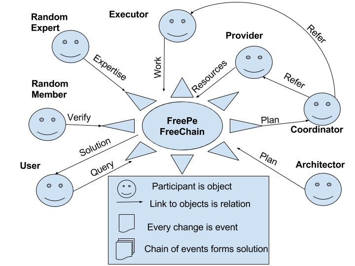

# Генерация FreePenny

Каждый реальный человек имеет возможность получать вознаграждение за полезный вклад в развитие ФриПе. На этом принципе основан выпуск криптоактива FreePenny или FPN. 
Участниками сети ФриПе ставятся цели, необходимые для процветания, которые разбиваются на задачи. Например, поступает запрос на разработку децентрализованной социально-экономической сети. 

Этот запрос проверяется на наличие готовых или аналогичных решений и в случае, если совпадений нет, подключается Архитектор, который должен предоставить знания - подробный план работ для реализации задачи. Дальше план попадает Координатору, задача которого - найти и предоставить нужные ресурсы. Координатор приглашает для выполнения заданий Провайдера, который предоставляет ресурсы, а также он приглашает Исполнителя для составления итогового решения. Исполнители видят список задач, которые нужно выполнить и выбирают ту, которую считают наиболее подходящей, учитывая свои таланты и предпочтения. Во время работы, специалист учитывает потраченное время и дополнительные расходы. Далее готовое решение анализируется случайно выбранным Экспертом, который должен оценить реальную стоимость, опираясь на три параметра: качество, сложность, эффективность; и на проверку случайно выбранному Участнику сети, который должен подтвердить соответствие решения к задаче. Затем ФриПе предоставляет проверенное решение Пользователю и, в случае его принятия - генерирует FreePenny, которые начисляются всем участникам цепочки, в соответствии от ценности вклада каждого. Вся последовательность событий, начиная от запроса и заканчивая готовым решением группируются в блок Решение, которое хранится в FreeChain и может быть использовано в дальнейшем для решения аналогичных задач другими участниками сети.

После разработки решения, итоговая стоимость в эквиваленте FPN составляется по формуле $$P = i*q*h*r + c$$, где i - индекс специальности, q - квалификация исполнителя, h - количество потраченных часов, r - рейтинг полезности, с - стоимость вложенных ресурсов в эквиваленте.

Индекс i вполне может быть меньше 1, ведь он оценивается относительно стоимости 1 FPN. Например, можно найти начинающего программиста, который согласен работать за 0.5 FPN/час, значит индекс его специализации 0.5. 

Рейтинг полезности - это величина для оценки соотношения творения и потребления. Скажем, человек создал решение, получил за него деньги и все потратил на свои личные нужды и желания. В таком случае, рейтинг = 1. Если же человек, например, нарисовал картину продал её за 1000 FPN, при этом оставит себе половину, а остальное пустил на благотворительность - тогда его рейтинг = 2. Таким образом, эта величина способствует развитию у людей стремления больше отдавать, чем брать и позволяет искоренить паразитов.

Квалификация оценивает навыки в конкретной области деятельности в зависимости от количества часов потраченных на обучение/работу в этой сфере. Каждые 100 часов = 1 балл. Эти цифры основаны на правиле 10000 часов. Однако, это далеко не фиксированная величина, ведь одни люди могут всю жизнь отдать нелюбимой профессии, при этом так и не став в ней профессионалами, а другие за пару лет могут стать экспертами. Поэтому заявленный уровень квалификации должен быть подтвержден путём сдачи экзамена. Скажем, веб-разработчик потратил в общей сложности 600 часов на работу и обучение своей профессии, и повысил свою квалификацию в сфере разработки веб приложений в 6 раз (q=6).Следовательно, его качество жизни улучшается тоже, ведь он больше дает и больше получает. Один час работы такого специалиста равен 3.96*6=23.84 доллара в час.

Рассмотрим конкретный пример реализации личного кабинета с использованием JavaScript, Node.js, CSS и HTML. При этом каждая из технологий имеет свой коэффициент квалификации. Итоговый коэффициент на задание формируется исходя из расчета проработанных часов каждой технологии, вследствие чего формируется средневзвешенный параметр.
Например, программист сообщил, что его навыки следующие: 
Pure JavaScript = 8, Node.js = 3, CSS = 7, HTML = 9. 
При этом для реализации дашбоарда нужно 
JavaScript 50 часов, из них Node.js 30 часов (так как JS платформа), но нужно ещё чистый JS использовать 20 часов, ещё CSS 15 и HTML 12.

Средневзвешенный коэффициент квалификации = $$\frac{30*3+20*8+15*7+12*9}{30+20+15+12}=6.0$$

Далее эту задачу оценивают специалисты этого же профиля - другие разработчики. Цель их экспертизы - удостовериться в соответствии работы к заявленной стоимости. Для этого они оценивают три параметра:

1. **Качество** - насколько хорошо сделана работа, надёжность выполнения основной задачи, количество багов и недочётов. 
2. **Эффективность** - насколько быстро реализовано, реальный КПД, количество затраченных ресурсов. 
3. **Функциональность** - какой сложности алгоритм был использован и какие дополнительные возможности получены.

Оценка по всем трем параметрам происходит независимо друг от друга, после чего каждый специалист генерирует отчет, в котором исходя из результатов исследований он указывает, насколько согласен с указанным эквивалентом стоимости работ, или же не согласен вовсе. 

В случае несоответствия, исполнителю предлагается пересмотреть запрошенную сумму. Если консенсус насчет стоимости выполненной работы не достигнут, т.е. если исполнитель не соглашается изменить стоимость, то проверяющий должен быть готов предоставить свое собственное решение задачи. Далее добавляются дополнительные независимые проверяющие, которые оценивают уже две работы.

При достижении консенсуса наступает этап оценки сообществом - простыми пользователями или заказчиками, которые оценивают задачу в общем:на удобство, эстетические качества и т.д. В случае наличия нескольких вариантов решений, пользователи голосуют, и тот, который нравится большинству - утверждается как основной. В любом случае, когда предложение понравилось как минимум двум незнакомым людям - оно также считается принятым.
Тогда для принятых решений генерируются FPN по формуле P, которые идут в кошелек исполнителя/-ей:

$$P = 1 * 0.86 * 6.0 * 77 + 0= 397.32$$ FPN.
  
Таким образом, каждая единица FPN обеспечена реальным трудом человека. Исполнители смогут продать этот криптоактив пользователям, которые могут использовать его как расчетное средство - могут просто покупать продукты и услуги других пользователей, либо использовать как средство накопления.
В конце каждой неделе происходит формирование новой рыночной цены на следующую неделю. Мы считаем, что самая востребованная единица – это время, а стоимость 1 FPN – это средневзвешенная стоимость одного часа работы любого человека. Если в начале установлено 1, а затем в течении времени среднее значение стоимости труда реальных людей устаканивается на отметке 2 – это значит, что цена 1 FPN вырастет в два раза. Такой прирост может быть достигнут благодаря улучшению качества жителей участников, потому что мы планируем:

- Расширение сфер деятельности и развитие инфраструктуры; 
- Приобретение знаний и синтез новых технологий;
- Увеличение качества и количества специалистов; 
- Производство востребованных и качественных товаров.

Каждый человек, который генерирует FPN, даёт обещание принимать FreePenny в качестве оплаты за свои товары и услуги. Таким образом, люди всегда могут использовать FreePenny чтобы купить продукцию или голосовать за реализацию желаемых функциональных возможностей. Таким образом, увеличение ликвидности FPN будет осуществлено возможностью гарантированного получения востребованной продукции - работ по разработке сайта, созданию дизайна, составлению контента, продвижению предприятия, проведения маркетинговых и краудсорсинговых кампаний, а также любых других услуг и товаров, которые будут предлагать непосредственно члены и партнёры FreePe. 

